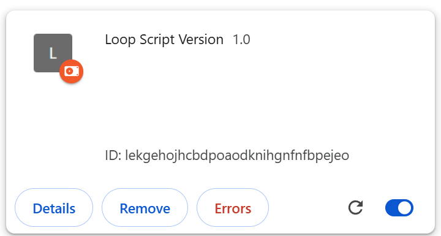

With this extension enabled, you can just use ?scriptVersion as before, this serves as a temporary solution before scriptVersion is supported again.

This extension uses "webRequestBlocking" permission with manifest V3, which is only supported in developer mode due to security reasons, so this can only be loaded as a "unpacked extension".

- Download the "LoopScriptVersion.zip", extract it into a folder.
- Open the browser extension page, enable "developer mode".
- Click "Load Unpacked", and choose the folder.
- All done!

